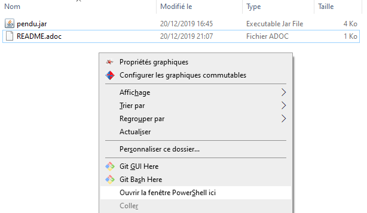

= Executable du jeu de pendu

== Comment le lancer

* Télécharger le fichier .jar

* Faire Shift + Clic droit dans l'explorateur Windows dans le rèpertoire du fichier téléchargé (ne pas clicker au niveau du fichier)

* Dans le panneau qui s'ouvre selectonner `"ovrir  la fenetre PowerShell ici"`

* Taper dans PowerShell:

[source,bat]
---- 

java -jar pendu.jar

----